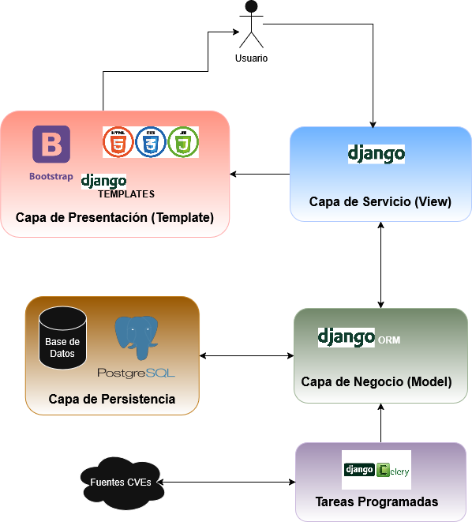
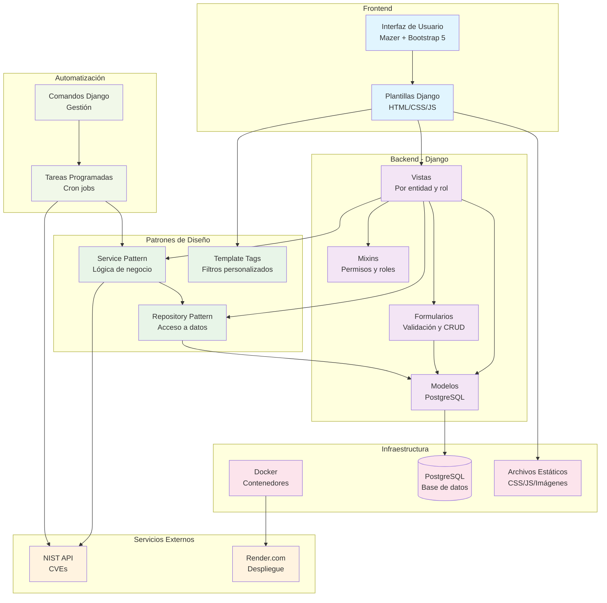
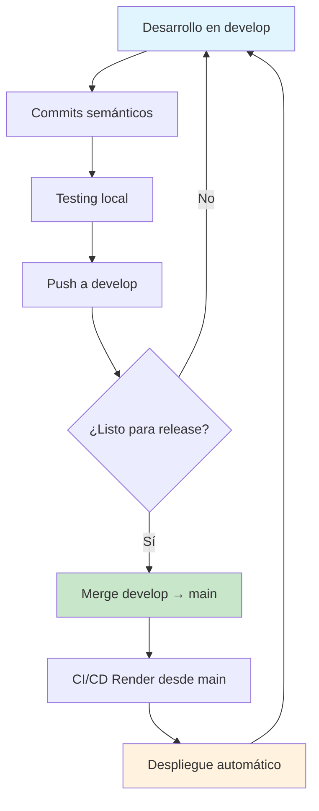
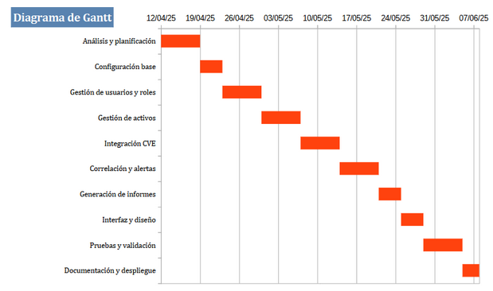
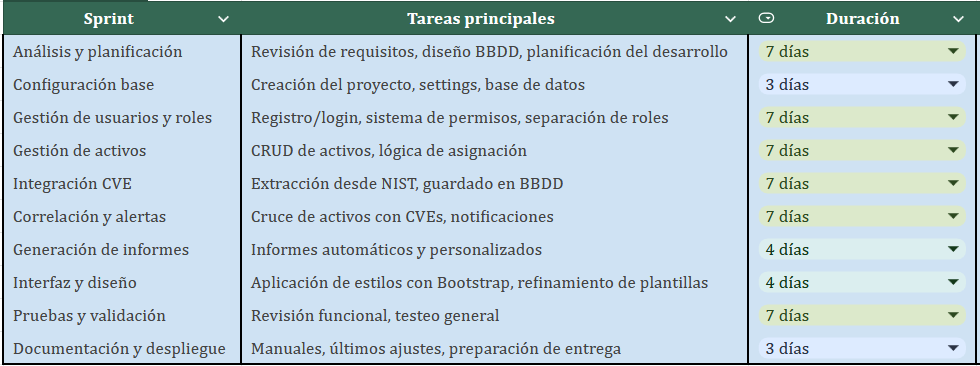
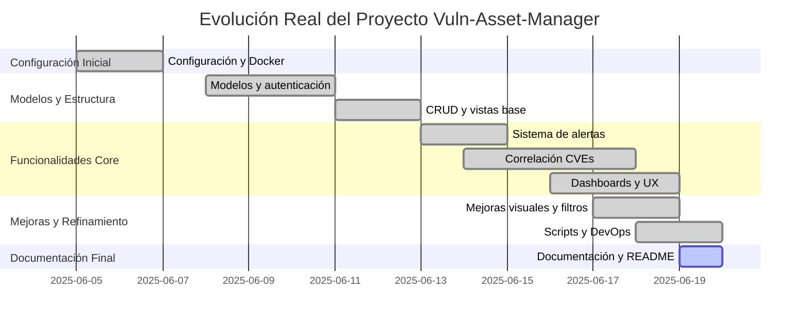
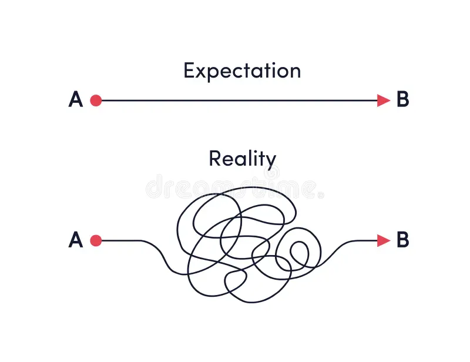

# Vuln-Asset-Manager

Sistema de gestión de activos tecnológicos y vulnerabilidades para empresas, desarrollado como Proyecto Fin de Ciclo para el Ciclo Superior de Desarrollo de Aplicaciones Web.

## Autor - Adrián García Bouzas

## 1. Motivación

La idea nace de una tarea que nos asignan en la empresa que consiste en encontrar, de forma diaria, todas las CVEs que podrían afectar potencialmente la lista de activos de un cliente.

**¿Qué es un CVE?** Vulnerabilidades y Exposiciones Comunes Básicamente, es un diccionario público de vulnerabilidades que permite a los profesionales de la ciberseguridad identificar y abordar problemas de seguridad de forma estandarizada.

**Problema:** Se publican diariamente 150 CVEs nuevas de media, y además puede haber actualizaciones en las ya existentes. Se hace inviable una revisión manual. 

**Solución:** Una plataforma web que centralice la gestión de activos, automatice la detección de vulnerabilidades y proporcione alertas personalizadas según parámetros como la severidad o el cvss score.

## 2. Demostración del funcionamiento

### Funcionalidades implementadas:
- ✅ **Gestión completa de usuarios, clientes, activos y vulnerabilidades**
- ✅ **Sistema de tareas programadas** con expresiones cron
   - ✅ **Integración con la API del NIST** para importación automática de CVEs
   - ✅ **Correlación automática activo-vulnerabilidad** mediante palabras clave
- ✅ **Sistema de alertas** con estados y seguimiento
- ✅ **Dashboards diferenciados por rol** (admin, analista, cliente)
- ✅ **Filtros avanzados** por severidad, estado, fechas y búsqueda de texto
- ✅ **Experiencia visual unificada** con Mazer (basado en Bootstrap 5)
- ✅ **Seguridad y control de acceso** por rol con mixins de permisos


- ✅ **Paginación y navegación** consistente en todos los listados

### Historias de usuario cumplidas:
- ✅ Actualización automática de vulnerabilidades desde NIST
- ✅ Alta de clientes y activos desde archivo externo (CSV)
- ✅ Alta de analistas y asignación de clientes
- ✅ Visualización por parte del analista con métricas y dashboards
- ✅ Alertas automáticas por vulnerabilidades críticas(\*)
- ✅ Consulta de histórico de vulnerabilidades por parte del cliente(\*)

> 
> La demo de la aplicacion está disponible en este [enlace](https://vuln-asset-manager.onrender.com/). 
> - **Aceso como administrador**
>   - User: admin Pass: Admin123!
> - **Acceso como analista** 
>   - User: marta.garcia Pass: renaido.
> - **Acceso como cliente** 
>   - User: it_santander Pass: renaido.

## 3. Justificación de objetivos alcanzados y no alcanzados

### Objetivos específicos alcanzados:
- ✅ **Gestión de activos tecnológicos por cliente**: CRUD completo con asignación a clientes
- ✅ **Base de datos de vulnerabilidades CVE**: Modelos implementados con integración NIST
- ✅ **Extracción diaria de vulnerabilidades**: Comandos de gestión y servicios funcionales
- ✅ **Cruce de información activos-CVEs**: Correlación automática implementada
- ✅ **Sistema de alertas**: Generación automática y gestión de estados
- ✅ **Roles diferenciados y permisos**: Implementados y revisados
- ✅ **Escalabilidad y seguridad**: Docker, buenas prácticas Django, control de acceso

### Pendientes justificados:
- ⏳ **Notificaciones por email**: Lógica preparada, falta integración final
- ⏳ **Generación/exportación de informes**: Resúmenes en dashboards, pendiente PDF/Excel
- ⏳ **Mejoras en el sistema de tareas programadas**: Mejora del sistema de tareas actual con cron jobs implementando una sistema mas robusto basado en Celery, con colas de tareas y tolerancia a fallos. 

**Justificación:** Se priorizó la funcionalidad core y la experiencia de usuario. Los pendientes son mejoras que no afectan el MVP pero enriquecen la funcionalidad.

## 4. Descripción técnica

### a. Arquitectura y tecnologías utilizadas

**Backend:**
- Django 4.2 (patrón MVT)
- Python 3.11
- PostgreSQL 15

**Frontend:**
- HTML5/CSS3
- [Mazer Template](https://zuramai.github.io/mazer/) (basado en Bootstrap 5)
- JavaScript para interactividad

**Infraestructura:**
- Docker y Docker Compose
- Render.com para despliegue
- [NIST API](https://nvd.nist.gov/developers/vulnerabilities) para la recolección de CVEs

**Patrones de diseño:**
- Repository Pattern para acceso a datos
- Service Pattern para lógica de negocio
- Mixin Pattern para permisos



### b. Diagrama de componentes



### c. Estructura del proyecto
```
vuln-asset-manager/
├── config/                # Configuración Django
├── vuln_manager/          # Aplicación principal
│   ├── models/           # Modelos organizados por entidad
│   ├── views/            # Vistas modularizadas por entidad
│   ├── forms/            # Formularios organizados por entidad
│   ├── repository/       # Patrón repositorio por entidad
│   ├── services/         # Lógica de negocio
│   ├── tests/            # Tests unitarios y de integración
│   ├── templates/        # Plantillas específicas de la app
│   ├── static/           # Archivos estáticos específicos
│   ├── fixtures/         # Datos de prueba
│   ├── management/       # Comandos de gestión
│   ├── mixins/           # Mixins de permisos
│   └── templatetags/     # Filtros de plantilla
├── templates/            # Plantillas globales
├── static/               # Archivos estáticos globales
├── docs/                 # Documentación del proyecto
├── scripts/              # Scripts de utilidad
├── docker-compose.yml    # Configuración Docker
├── Dockerfile           # Imagen Docker
├── requirements.txt     # Dependencias de producción
└── requirements-dev.txt # Dependencias de desarrollo
```


## 5. Metodología de desarrollo

### Flujo de trabajo en GitHub:
- **Ramas principales:** `main` (producción) y `develop` (desarrollo)
- **Desarrollo directo** en `develop` con merges a `main` para releases
- **Integración continua** con despliegue automático en Render desde `main`
- **Commits semánticos** para seguimiento de cambios



### Prácticas de desarrollo:
- **Patrón Repository** para separación de responsabilidades
- **Documentación** continua en [docs/](docs/)
- (\*)**Testing** y (\*)**TDD**


## 6. Planificación y seguimiento

### a. Diagrama de Gantt previo


### b. Tabla de planificación temporal


### c. Diagrama de Gantt final



### d. Análisis de diferencias


## 7. Análisis de tiempos invertidos

### Distribución temporal por componentes (Real):

| Componente | Tiempo estimado | Justificación |
|------------|----------------|---------------|
| **Configuración inicial** | 8h | Docker, Django, estructura base |
| **Modelos y autenticación** | 15h | Modelos complejos, roles, permisos |
| **Vistas y CRUD básico** | 20h | Vistas por entidad, formularios, templates |
| **Sistema de correlación** | 25h | Lógica compleja, servicios externos (NIST) |
| **Dashboards y UX** | 16h | Diseño visual, Mazer, filtros |
| **Sistema de alertas** | 10h | Estados, prioridades, workflow |
| **Testing y refactorización** | 10h | Tests unitarios, patrones Repository |
| **Despliegue y DevOps** | 15h | Render, scripts, configuración producción |
| **Documentación** | 6h | README, docs, presentación |

**Total estimado real: 125 horas**

### Comparación con planificación inicial:

| Aspecto | Planificado (según imagen) | Real (estimado) | Diferencia |
|---------|----------------------------|-----------------|------------|
| **Tiempo total** | 140h | 125h | -15h (-11%) |
| **Funcionalidades** | 100% | 85% | -15% |

### Justificación de la diferencia:

La diferencia de 15 horas entre el tiempo planificado (140h) y el real (125h) se debe a un **recorte en el alcance del proyecto por falta de tiempo**.

Para asegurar la entrega de un producto funcional y de calidad dentro del plazo establecido, se decidió priorizar el desarrollo de las funcionalidades esenciales (Producto Mínimo Viable). Esto implicó descartar características que, aunque estaban planificadas, no eran críticas para el sistema, como la generación avanzada de informes y las notificaciones por email.

En resumen, la reducción de tiempo refleja directamente las funcionalidades que no se implementaron para cumplir con la fecha de entrega.

## 8. Presupuesto

### Costes actuales del proyecto:

| Concepto | Coste | Justificación |
|----------|-------|---------------|
| **Desarrollo** | 0€ | Software libre (Django, Python, PostgreSQL) |
| **Herramientas** | 0€ | GitHub, Docker, VS Code (versiones gratuitas) |
| **Servidor web - Render** | 7€/mes | Plan básico para aplicación Django |
| **Base de datos - Render** | 7€/mes | PostgreSQL dedicado |
| **Dominio** | 0€ | Subdominio gratuito de Render |
| **SSL/HTTPS** | 0€ | Certificado gratuito incluido en Render |

**Total mensual actual: 14€/mes**

**Coste Desarrollo: 125h * 25€/h = 3125€**

### Costes futuros estimados:

| Concepto | Coste estimado | Justificación |
|----------|----------------|---------------|
| **Agentes de IA** | 50-200€/mes | Para mejorar correlación activo-CVE |
| **Celery + Redis** | 15-30€/mes | Sistema de colas para tareas programadas |
| **Escalado Render** | 25-100€/mes | Para mayor tráfico y funcionalidades |
| **Monitoreo** | 10-20€/mes | Herramientas de observabilidad |

**Total mensual futuro estimado: 114-364€/mes**

### Justificación de costes:

**Software gratuito:** El stack tecnológico elegido (Django, PostgreSQL, Docker) permite desarrollar un sistema robusto sin costes de licencias.

**Render.com:** Plataforma ideal para proyectos Django con despliegue automático. El coste incluye servidor web dedicado y base de datos PostgreSQL separada.

**Costes futuros:** Inversión en automatización e IA que mejoraría significativamente la eficiencia del sistema.

## 9. Conclusiones

### a. Posibles mejoras:

#### Funcionalidades pendientes (planificadas pero no implementadas):
- **Notificaciones por email** para alertas críticas y reportes automáticos
- **Exportación de informes** en PDF/Excel con gráficos y estadísticas
- **Sistema de colas con Celery** para tareas asíncronas (correlación, notificaciones)

#### Mejoras técnicas futuras:
- **Integración de IA** para mejorar el algoritmo de correlación activo-CVE
- **Dashboard del cliente** más personalizado con gráficos interactivos
- **API REST** para integración con sistemas externos y automatización

### b. Principales dificultades encontradas:

#### Gestión de base de datos en Docker:
- **Problema**: Migraciones y sincronización en despliegue
- **Solución**: Scripts de inicialización (`init_project.sh`, `populate_demo_data.py`)

#### Sistema de permisos complejo:
- **Problema**: Filtrado por rol y cliente simultáneamente
- **Solución**: Mixins de permisos (`RoleRequiredMixin`) + filtros en repositorios


#### Configuración de entorno:
- **Problema**: Variables de entorno locales interfiriendo con producción
- **Solución**: Eliminación de archivos `.env` locales y configuración específica por entorno

### Logros destacados:
- **Arquitectura escalable** con patrones de diseño sólidos
- **Experiencia de usuario** unificada y adaptada por rol
- **Despliegue automatizado** en Render con Docker


## 10. Preguntas
Espacio para preguntas del tribunal y compañeros/as.

---

